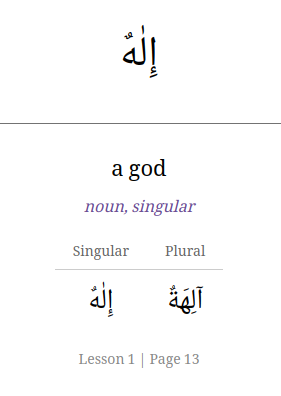
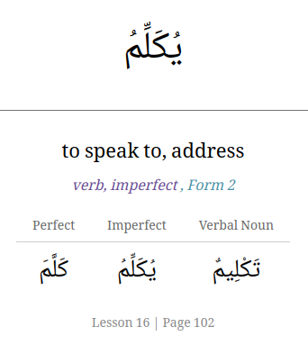

# Anki Setup and Usage Guide for "Arabic Through the Quran" Flashcards

This repository creates an
[Anki deck (.apkg file)](https://github.com/julowe/arabic-apis/releases/latest)
with the vocabulary and exercises from each Lesson in the textbook "Arabic
Through the Quran".

The 'front' of each flashcard has just the Arabic word.
The 'back' of each flashcard will have the Arabic word from the 'front' of
the card, a horizontal line, and then the English translation and much
more information.
Below are examples of the 'back' of a noun and a verb flashcard:

(Ok, right now the flashcards are only of the vocabulary, because the exercises
have a bunch of errors that I need to correct first.
Oh, and I've only checked up to Lesson 17 of the vocabulary so far.)

The Anki deck consists of one main deck and then a sub-deck for the vocabulary
from each chapter.
An Anki Note was created for each vocabulary entry (which contains all the
information from the textbook for vocabulary row).
There are usually multiple Anki Cards generated per note (e.g. two cards for a
vocabulary entry with the Single and the Plural specified, or three cards for
a verb entry).
You may want to tweak how cards are shuffled or not, see below for instructions.

## Installation

All of the Anki apps (desktop, web, mobile) can access your decks and
synchronize your progress if you sign up for a free account at
[AnkiWeb](https://ankiweb.net).
However, you need to use a desktop or mobile app to initially import the deck.

Applications for desktop and mobile phones are available, most of them are free.
See [Anki's Download page](https://apps.ankiweb.net/#downloads) for links.
The iOS application is the only paid one, and it is $25, but others have said
it is worth it.
I have yet to try it - I just use the desktop app to import decks and then
mostly study cards on my phone's browser with their free website.

## Importing the Deck

Once you have installed Anki and downloaded the
[attq-vocab-deck.apkg file from the latest release in this repository](https://github.com/julowe/arabic-apis/releases/latest):

1. Open Anki on your desktop or mobile device.
2. Select **File \> Import** (or tap **Import** on mobile).
3. Locate and select the .apkg file.
4. When the confirmation window appears, you should not need to change any
   settings unless told otherwise.
   - If I get around to creating a deck with some convenient options already
     preset and cards/sub-decks from future chapters suspended, then you will
     want to ensure the following options are Checked/Enabled:
     - ✅ **Include scheduling information**
     - ✅ **Include deck presets**

### Updating an existing deck

If you previously imported an earlier version of this deck and have downloaded a newer `.apkg` file from this repository:

1. **Import the updated file**:
   - In Anki Desktop, go to **File \> Import...** (or press `Ctrl+I` / `Cmd+I`).
   - Locate and select the newly downloaded `.apkg` file.
   - In the import options window that appears:
     - Check the **Existing notes** setting and make sure it is set to **Update** (do **not** choose "Do not overwrite" or "Ignore"). This ensures any typo fixes, added definitions, or corrections are applied to your notes while **preserving your review history and scheduling progress**.
   - Click **Import**.

2. **Remove obsolete or empty cards (Tools \> Empty Cards)**:
   - When a note is updated (for example, if a mistaken plural form or duplicate was corrected/removed in the source .csv file), Anki updates the note's text, but it **does not automatically delete already-created cards** to ensure it never accidentally erases your review data.
   - This leaves the old card with a blank front (an "empty card").
   - To clean these up safely without losing any study progress:
     1. In the main Anki Desktop window, go to the top menu and select **Tools \> Empty Cards...**.
     2. Anki will scan your collection and show a list of any cards whose front side is now blank.
     3. Click **Delete Cards**.
   - All your review history, due dates, and study intervals on all other cards will remain completely safe and intact.

## How to Rate Cards During Reviews

When studying, Anki will show you the 'front' of the card, which has the
Arabic word.
Attempt to recall the meaning (and grammatical info, e.g. singular, dual, or
plural for nouns or perfect, imperfect, or verbal noun for verbs, etc.), then
press **Show Answer**.
You must then tell the application's algorithm how well you remembered it using
the four rating buttons.

**Warning:** Do not use "Hard" just because you want to see a card sooner, and
do not use "Easy" just to clear the queue - you do not need to finish all the
cards in a review session.

| Button    | Meaning      | When to use it                                                                                           | Effect                                                                                                       |
| :-------- | :----------- | :------------------------------------------------------------------------------------------------------- | :----------------------------------------------------------------------------------------------------------- |
| **Again** | **Fail**     | You could not recall the meaning, or you got it wrong.                                                   | Resets the card. You will see it again very soon (usually within minutes) to relearn it.                     |
| **Hard**  | **Struggle** | You got the answer **correct**, but it took significant mental effort or time to remember.               | Shows the card slightly sooner than normal. **Use sparingly** to avoid "Ease Hell" (seeing cards too often). |
| **Good**  | **Normal**   | You got the answer correct with a reasonable amount of focus.                                            | **This is the default button.** If you knew it, press Good.                                                  |
| **Easy**  | **Instant**  | You knew the answer instantly without thinking (e.g., a word you already knew before starting the book). | Pushes the card far into the future.                                                                         |

## Optional: Organizing Your Study (The "Suspend" Method)

This deck contains vocabulary from all the Lessons in the textbook.
All cards in the deck have a sort ID that contains the chapter number, but
Anki may randomly shuffle cards and present you with a card from a Lesson
we haven't studied yet - I'm not completely sure how its shuffling works.

You can either click on a sub-deck (e.g. 'Lesson 01 - Vocabulary') to see only
the cards from that chapter, or you can follow the directions below to suspend
cards from future chapters and then unsuspend them when you reach that chapter.

**The Strategy:** You can "Pause" (Suspend) any number of cards from the deck,
and then "Unpause" (Unsuspend) cards/chapters as you reach them in the book.

### Step 1: Suspend Everything

1. Open the **Browser** (Card Browser).
2. Select the _Arabic Through the Quran_ deck on the left.
3. Select **All Cards** (Ctrl+A or Cmd+A on Desktop).
4. Right-click and select **Toggle Suspend**.
   - _Result:_ All cards will turn yellow (or gray out). They are now inactive.

### Step 2: Unsuspend Current Chapter

When you start **Chapter 1**:

1. Go to the Browser.
2. Search for the Chapter 1 tag (e.g., tag:Chapter01) or find it in the sidebar.
   - You can also use the `Anki-id` field (also listed as `Sort Field`) which
     is of the form Chapter-v/e-Number (e.g. `02-v-05` is the 5th
     **V**ocabulary word in Chapter 2)
3. Select all cards for _just this chapter_.
4. Right-click and select **Toggle Suspend** again.
   - _Result:_ These cards turn white/active. They will now appear in your
     daily review session.

_Repeat Step 2 as you progress to new chapters._
